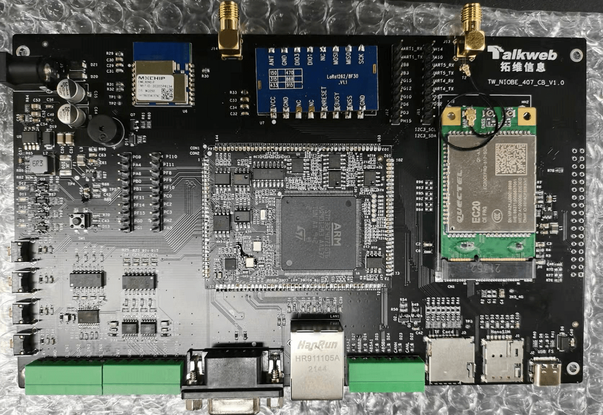
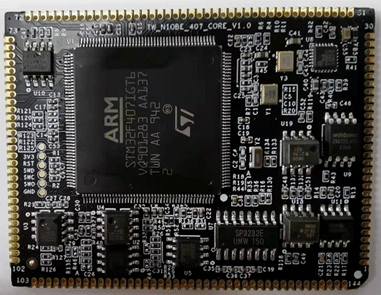
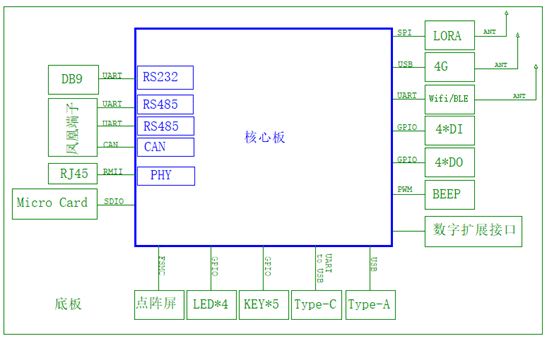

# Niobe407 EVB
# 简介
Niobe407开发板是基于意法半导体STM32F407IGT6芯片,由拓维信息系统股份有限公司出品的一款高性能、多功能，助力于工业、交通领域的开发板。它基于高性能 ARM® Cortex™-M4 32 位内核，工作频率高达 168 MHz，具有浮点运算单元 (FPU)，该单元支持所有ARM单精度数据处理指令和数据类型。集成了高速嵌入式存储器，具有Flash大小1MB，SRAM大小192KB。外设包含一路RJ45以太网、两路CAN、一路RS232、两路R485、一路I2C和一个全速USB OTG。并且底板板载支持外挂usb 4G模块、Lora及WIFI蓝牙模块。

开发板分为核心板和底板两部分，

- 开发板整体外观图片

   

- 核心板外观图片

   

# 硬件结构与功能框图
Niobe407开发板采用双板层叠结构：包括核心板（Core）+ 底板（Base）。核心板以四面邮票孔形式引出；底板包括电源输入、LED、按键、通用输入输出、RS232、RS485、CAN、Micro SD、Nand SIM、TypeC等接口以及4G、Wifi/BLE、Lora等选配功能模块。开发者可在Niobe407上验证和开发自己的软件和功能，同步使用核心板进行硬件开发，能够大大缩短产品研发周期并快速推向市场。

- 功能框图

   

# 开发板资源
| 器件类别 | 开发板 |
| ----  | ---- | 
| CPU | 单核Cortex-M4F(主频最高168MHz) |
| FLASH | 片内1MB+外挂16MB |
| RAM | 128KB RAM + 64KB CCMRAM|
| GPIO | 20个 |
| I2C | 1路 |
| UART | 2个 |
| RS232 | 1路 |
| RS485 | 2路 |
| CAN | 1路 |
| PWM | 1个 |
| JTAG | 1个 |
| ADC | 3个 |
| 有线网口 | 1个 |
| FMSC LCD  | 1个 |
| 4G模块 | 1个 |
| WIFI/BLE模块 | 1个 |
| Lora模块 | 1个 |

# 帮助文档
- [开发环境搭建与固件编译](docs/software/开发环境搭建与固件编译.md)
- [固件烧录](docs/software/固件烧录.md)
- [快速开发指南](docs/software/快速开发指南.md)

# 联系
如果您在开发过程中有问题，请在仓库[issues](https://gitee.com/openharmony-sig/device_board_talkweb/issues)中提问。