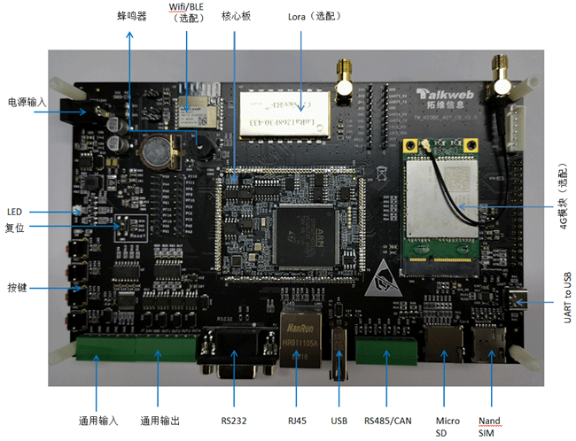

# Niobe407 EVB
# 简介
Niobe407开发板是基于意法半导体STM32F407IGT6芯片,由湖南开鸿智谷数字产业发展有限公司出品的一款高性能、多功能，助力于工业、交通领域的开发板。它基于高性能 ARM® Cortex™-M4 32 位内核，工作频率高达 168 MHz，具有浮点运算单元 (FPU)，该单元支持所有ARM单精度数据处理指令和数据类型。集成了高速嵌入式存储器，具有Flash大小1MB，SRAM大小192KB。外设包含一路RJ45以太网、两路CAN、一路RS232、两路R485、一路I2C和一个全速USB OTG。并且底板板载支持外挂usb 4G模块、Lora及WIFI蓝牙模块。

- 开发板整体外观图片

   

- 核心板外观图片

   

# 开发板规格
| 器件类别 | 开发板 |
| ----  | ---- | 
| CPU | 单核Cortex-M4F(主频最高168MHz) |
| FLASH | 片内1MB+外挂16MB |
| RAM | 128KB + 64KB |
| GPIO | 20个 |
| I2C | 1路 |
| UART | 2个 |
| RS232 | 1路 |
| RS485 | 2路 |
| CAN | 1路 |
| PWM | 1个 |
| ADC | 3个 |
| 有线网口 | 1个 |
| FMSC LCD  | 1个 |
| 4G模块 | 1个 |
| WIFI/BLE模块 | 1个 |
| Lora模块 | 1个 |

# 文档目录结构
- [开发环境搭建与固件编译](docs/software/开发环境搭建与固件编译.md)
- [固件烧录与U盘升级](docs/software/固件烧录与U盘升级.md)
- [快速开发指南](docs/software/快速开发指南.md)