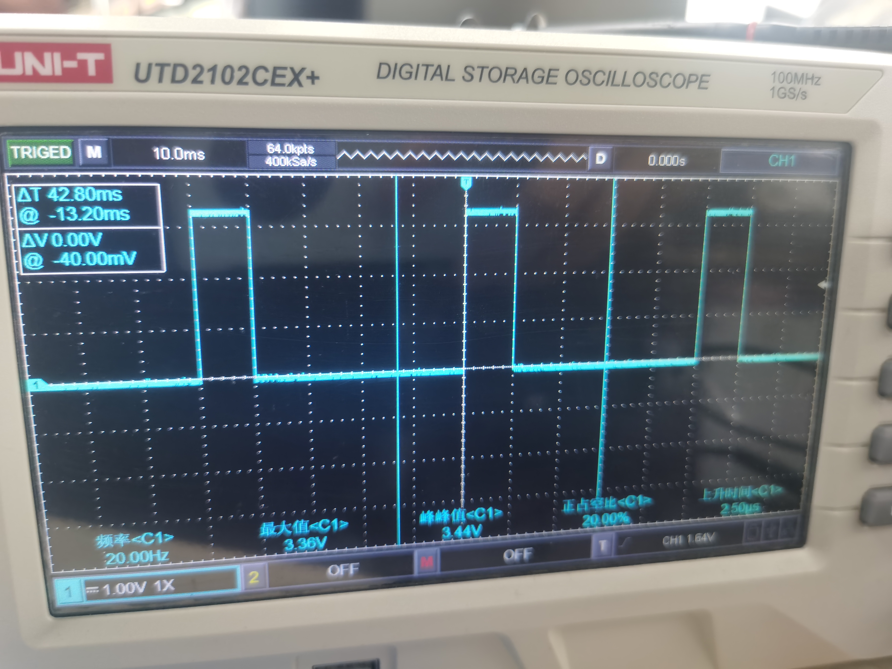
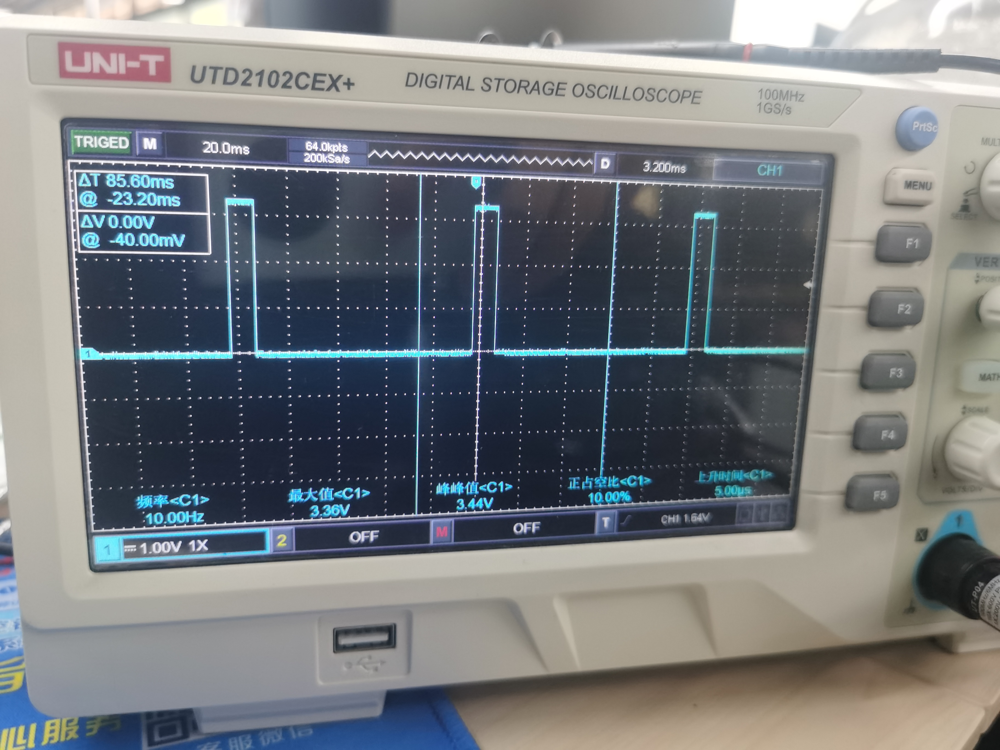

# Niobe407开发板OpenHarmony基于HDF驱动框架编程开发——PWM
本示例将演示如何在Niobe407开发板上通过HDF驱动框架，使用TIM2和TIM3定时器模拟pwm进行输出。


## 编译调试
- 进入//kernel/liteos_m目录, 在menuconfig配置中进入如下选项:

     `(Top) → Platform → Board Selection → select board niobe407 → use talkweb niobe407 application → niobe407 application choose`

- 选择 `206_hdf_pwm`

- 在menuconfig的`(Top) → Driver`选项中使能如下配置:

```
    [*] Enable Driver
    [*]     HDF driver framework support
    [*]         Enable HDF platform driver
    [*]             Enable HDF platform pwm driver
```
- 回到sdk根目录，执行`hb build -f`脚本进行编译。

### 运行结果

示例代码编译烧录代码后，按下开发板的RESET按键，通过串口助手查看日志
```
[HDF:I/HDF_LOG_TAG]open pwm 2 success!                                          
                                                                                
[HDF:I/HDF_LOG_TAG]PwmSetConfig success ! duty is 10000000                      
                                                                                
[HDF:I/HDF_LOG_TAG]open pwm 3 success!                                          
                                                                         
[HDF:I/HDF_LOG_TAG]PwmSetConfig success ! duty is 10000000 
```
使用示波器接对应的管脚可以观察到对应的PWM输出波形如下图所示

此图为PWM2的输出波形，频率为20hz, 占空比为20%，对应PA3 引脚

此图为PWM3的输出波形，频率为10hz, 占空比为10% 对应PA6引脚
# OpenHarmony驱动子系统开发—PWM

## 概述
    PWM（Pulse Width Modulator）即脉冲宽度调节器，在HDF框架中，PWM的接口适配模式采用独立服务模式，在这种模式下，每一个设备对象会独立发布一个设备服务来处理外部访问，设备管理器收到API的访问请求之后，通过提取该请求的参数，达到调用实际设备对象的相应内部方法的目的。独立服务模式可以直接借助HDFDeviceManager的服务管理能力，但需要为每个设备单独配置设备节点，增加内存占用。

## 接口说明
    1. pwm open初始化函数:DevHandle PwmOpen(uint32_t num);
        参数说明: 
            num:     PWM设备编号
            return:  获取成功返回PWM设备句柄,失败返回NULL
    2. pwm close去初始化函数：void PwmClose(DevHandle handle);
        参数说明：
            handle：   pwm设备句柄，
            return:    无
    3. 设置PWM设备参数：int32_t PwmSetConfig(DevHandle handle, struct PwmConfig *config);
        参数说明：
            handle：   pwm设备句柄，
            *config    参数指针
            return:    返回0表示设置成功，返回负数表示失败
## PWM HDF HCS配置文件解析
- device_uart_info.hcs文件位于/device/board/talkweb/niobe407/sdk/hdf_config/device_pwm_info.hcs,本例子使用的是TIM2和TIM3定时器模拟的PWM信号
```

root {
    module = "talkweb,stm32f407";
    device_info {
        match_attr = "hdf_manager";
        template host {
            hostName = "";
            priority = 100;
            template device {
                template deviceNode {
                    policy = 0;
                    priority = 100;
                    preload = 0;
                    permission = 0664;
                    moduleName = "";
                    serviceName = "";
                    deviceMatchAttr = "";
                }
            }
        }
        platform :: host {
            hostName = "platform_host";
            priority = 50;
            device_pwm1 :: device {
                pwm1 :: deviceNode {  //pwm config
					 policy = 2;
					 priority = 100;
					 moduleName = "NIOBE_HDF_PLATFORM_PWM";
					 serviceName = "HDF_PLATFORM_PWM_1"; // 编号要与PwmOpen入参一致，否则找不到service
					 deviceMatchAttr = "config_pwm1";
                }
            }
            device_pwm2 :: device {
                pwm2 :: deviceNode {  //pwm config
					 policy = 2;
					 priority = 100;
					 moduleName = "NIOBE_HDF_PLATFORM_PWM";
					 serviceName = "HDF_PLATFORM_PWM_2"; // 编号要与PwmOpen入参一致，否则找不到service
					 deviceMatchAttr = "config_pwm2";
                }
            }
        }
    }
}
```

- hdf_uart.hcs文件位于/device/board/talkweb/niobe407/sdk/hdf_config/hdf_pwm.hcs,在此文件中配置串口对应的GPIO引脚信息，串口配置信息
```
#include "device_pwm_info.hcs"
root {
    platform {
        pwm1_config {
            gpio_pwm1{ // PWM2 配置的gpio信息
                // 要配置的引脚个数，接下来的引脚名必须定义成gpio_num_1, gpio_num_2, gpio_num_3...
                gpio_num_max = 1; 
                // port, pin, mode, speed, outputType, pull, alternate
                gpio_num_1 = [0, 3, 2, 3, 0, 2, 1]; // tim2 ch4 pa3                
            }
            
            pwmconfig : gpio_pwm1 {
                match_attr = "config_pwm1"; // 本驱动默认使用pwm1模式 和上升计数模式
                pwmTim = 1;  // 定时器ID tim2 0 :tim1, 1:tim2 ..... tim6 和 tim7不可用
                pwmCh = 3;  // 对应chanel 4 0:ch1 1:ch2 2:ch3 3:ch4
                prescaler = 4199; // 预分频器 例如tim2 时钟为84M, (84M/(4199+1)) = 20khz, 然后以20khz 为基准 ,tim2-tim7, tim12-tim14为84M，TIM1、TIM8~TIM11 为168M，tim6和tim7不能输出pwm
                                  // tim1~tim5 tim8 有4个channel tim9,tim12有ch1, ch2,  tim10, tim11,tim13,tim14只有ch1 
            }       
        }
        pwm2_config {
            gpio_pwm2{ // pwm3配置的GPIO信息
                // 要配置的引脚个数，接下来的引脚名必须定义成gpio_num_1, gpio_num_2, gpio_num_3...
                gpio_num_max = 1; 
                // port, pin, mode, speed, outputType, pull, alternate
                gpio_num_1 = [0, 6, 2, 3, 0, 2, 2]; // tim3 ch1 pa6               
            }
            
            pwmconfig2 : gpio_pwm2 {
                match_attr = "config_pwm2"; // 本驱动默认使用pwm1模式 和上升计数模式
                pwmTim = 2;  // 定时器ID tim2 0 :tim1, 1:tim2 ..... tim6 和 tim7不可用
                pwmCh = 0;  // 对应chanel 4 0:ch1 1:ch2 2:ch3 3:ch4
                prescaler = 8399; // 预分频器 例如tim2 时钟为84M, (84M/(4199+1)) = 20khz, 然后以20khz 为基准,根据在pwmSetconfig 设置的period和duty,来计算频率 ,tim2-tim7, tim12-tim14为84M，TIM1、TIM8~TIM11 为168M，tim6和tim7不能输出pwm
                                  // tim1~tim5 tim8 有4个channel tim9,tim12有ch1, ch2,  tim10, tim11,tim13,tim14只有ch1 这个值如果16位最大分频数位65535
            }   
        } 
    }
}

```

## 例程原理简介
    NIOBE407开发板有可以使用TIM定时器来产生PWM波形，系统有TIM1和TIM8两个高级定时器，TIM2-TIM5，TIM9-TIM14为通用定时器，TIM6和TIM7是基本定时器，这两个定时器不用做PWM输出，Tim2-Tim7, Tim12-Tim14为84M，TIM1、TIM8~TIM11 为168M,Tim1~Tim5 Tim8 有4个channel Tim9,Tim12有ch1, ch2,  Tim10, Tim11,Tim13,Tim14只有ch1, 本例程使用TIM2的ch4 和 TIM3 的ch1来做示例，具体可前往device\board\talkweb\niobe407\sdk\hdf_config\hdf_pwm.hcs中根据您的开发板原理图进行修改

## 示例代码解析
```c
static void* HdfPwmTestEntry(void* arg)
{
    int32_t ret;

    uint32_t num;
    DevHandle handle = NULL;

    struct PwmConfig pcfg;
    pcfg.duty = 10000000; /*占空时间为10000000纳秒， 占空比为20%*/
    pcfg.period = 50000000; /*周期为50000000纳秒，计算出1s/50ms = 20hz为频率*/ 
    pcfg.number = 0; /*生成无限个方波*/
    pcfg.polarity = PWM_NORMAL_POLARITY; /*极性为正*/
    pcfg.status = PWM_ENABLE_STATUS; /*运行状态为启用*/

    /* PWM设备编号，要填写实际平台上的编号 */
    num = 1; //tim2

    /* 获取PWM设备句柄 */
    handle = PwmOpen(num);
    if (handle == NULL) {
        HDF_LOGE("PwmOpen: failed!\n");
        return;
    } else {
        HDF_LOGI("open pwm %u success!\n", num + 1);
    }

    /*设置PWM设备参数*/
    ret = PwmSetConfig(handle, &pcfg);
    if (ret != 0) {
        HDF_LOGE("PwmSetConfig: failed, ret %d\n", ret);
        goto _ERR2;
    } else {
        HDF_LOGI("PwmSetConfig success ! duty is %u\n", pcfg.duty);
    }

    DevHandle handle1 = NULL;

    struct PwmConfig pcfg1;
    pcfg1.duty = 10000000; /*占空时间为10000000纳秒， 占空比为10%*/
    pcfg1.period = 100000000; /*周期为100000000纳秒 1s/100ms = 10HZ 频率*/
    pcfg1.number = 0; /*生成无限个方波*/
    pcfg1.polarity = PWM_NORMAL_POLARITY; /*极性为正*/
    pcfg1.status = PWM_ENABLE_STATUS; /*运行状态为启用*/

    /* PWM设备编号，要填写实际平台上的编号 */
    uint32_t num2 = 2; //tim2

    handle1 = PwmOpen(num2);
    if (handle1 == NULL) {
        HDF_LOGE("PwmOpen: failed!\n");
        return;
    } else {
        HDF_LOGI("open pwm %u success!\n", num2 + 1);
    }

    /*设置PWM设备参数*/
    ret = PwmSetConfig(handle1, &pcfg1);
    if (ret != 0) {
        HDF_LOGE("PwmSetConfig: failed, ret %d\n", ret);
        goto _ERR1;
    } else {
        HDF_LOGI("PwmSetConfig success ! duty is %u\n", pcfg1.duty);
    }

    while (1) {
        LOS_TaskDelay(1000);
    }
_ERR1:
    /* 销毁PWM设备句柄 */
    PwmClose(handle);
_ERR2:
    PwmClose(handle1);
}
```