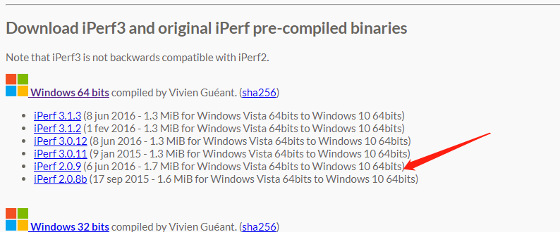
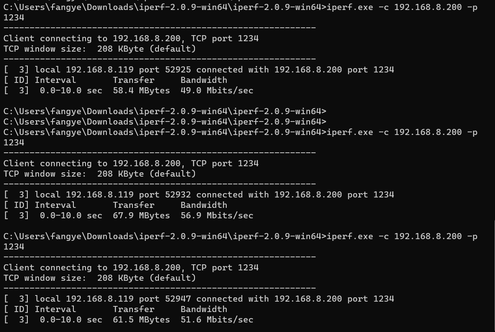

# Niobe407开发板iperf server网络带宽测试示例

本案例程序将演示怎么在拓维Niobe407开发板上对网络带宽进行测试。
## 编译调试
- 进入//kernel/liteos_m目录, 在menuconfig配置中进入如下选项:

     `(Top) → Platform → Board Selection → select board niobe407 → use talkweb niobe407 application → niobe407 application choose`

- 选择 `307_network_iperf_server`

- 为了方便测试，我们关闭DHCP功能，使用静态IP。
  
   注释头文件 `//device/board/talkweb/niobe407/sdk/lwip_adapter/include/app_ethernet.h` 中USE_DHCP宏定义

- 回到sdk根目录，执行`hb build -f`脚本进行编译。

### 运行结果

示例代码编译烧录代码后，按下开发板的RESET按键，通过串口助手查看日志
```
start ethernet config task...
use static IP:
ip........................192.168.8.200
netmask...................255.255.255.0
gw........................192.168.8.1
MacADDR: C8-32-F8-68-13-7A
ETH Init Success!
ETH LINK STATE: Connected!
lwiperf_start_tcp_server IP:192.168.8.200 port:1234
lwiperf tcp_server is running...
```

安装iperf网络测试工具：[https://iperf.fr/iperf-download.php#windows](https://iperf.fr/iperf-download.php#windows)

下载iPerf 2.0.9 版本:



解压iperf工具压缩包，打开CMD窗口，进入到iperf工具解压目录下:

执行如下命令进行测试:

```
iperf.exe -c 192.168.200 -p 1234
```



