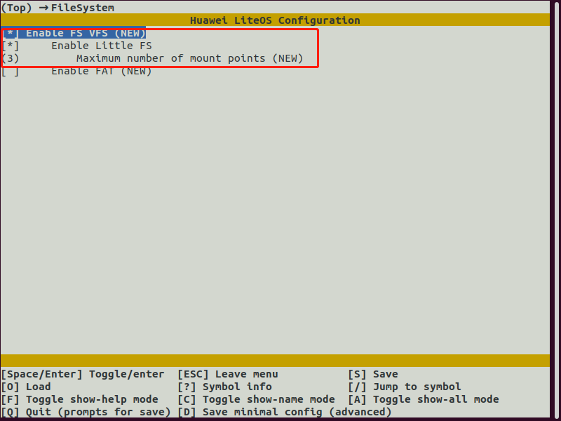
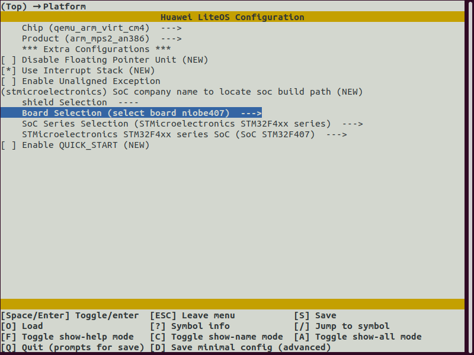
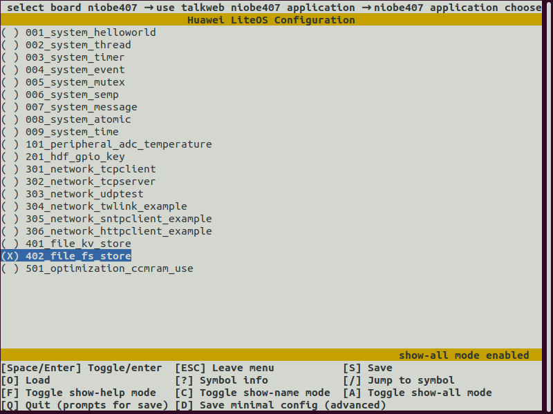

# littlefs使用说明

# 简述

LittleFS主要用在微控制器和flash上，是一种嵌入式文件系统，具有如下3个特点：

1. 掉电恢复

   在写入时即使复位或者掉电也可以恢复到上一个正确的状态。

2. 擦写均衡

   有效延长flash的使用寿命。

3. 有限的RAM/ROM

   节省ROM和RAM空间。

niobe407模组外接16M flash，在外挂flash的后8M挂载littlefs文件系统，默认挂载点为talkweb，默认创建存储数据的目录data，目录如下：

```
OHOS # ls
Directory /talkweb:
.                    <DIR>
..                   <DIR>
data                 <DIR>
talkweb0             8
talkweb1             7
wifi.cfg             28
```


# littlefs使用说明

littlefs需要通过内核配置进行选配，操作如下：

1. 切换到kernel/liteos_m/目录

   ```
   cd kernel/liteos_m/
   ```

2. 输入make menuconfig 打开内核配置界面

   ```
   make menuconfig
   ```

3. 选择FileSystem，选上littlefs



OpenHarmony已经实现了vfs，注册了littlefs的相关接口，vfs向标准文件操作提供对应的接口，因此应用可以调用的newlibc标准文件操作接口进行测试。

涉及的部分文件操作接口如下：

| 接口名   | 描述             |
| -------- | ---------------- |
| _open    | 打开文件         |
| _close   | 关闭文件         |
| _write   | 写文件           |
| _read    | 读文件           |
| _lseek   | 设置文件偏移位置 |
| mkdir    | 创建目录         |
| opendir  | 打开目录         |
| closedir | 关闭目录         |
| rmdir    | 删除目录         |
| mount    | 分区挂载         |
| unmount  | 分区卸载         |

## 测试

niobe407的littlefs的测试可以通过内核核配置打开，操作如下：

1. 切换到kernel/liteos_m/目录

   ```
   cd kernel/liteos_m/
   ```

2. 输入make menuconfig 打开内核配置界面

   ```
   make menuconfig
   ```

   弹出配置界面，选择Platform下的select board niobe407。

   

3. 选配application中的fs store。

   

测例：

```
static void dir_test(const char *path)
{
    DIR *dir;
    int ret ;
    struct dirent *dp;
    /*文件夹打开关闭测试*/
    if ((dir = opendir(path)) == NULL) {
        printf("opendir %s failed \n", path);
        return;
    }
    while ((dp = readdir(dir)) != NULL) {
        if (strcmp(dp->d_name, ".") == 0 || strcmp(dp->d_name, "..") == 0) {
            continue;
        }
        struct stat st_buf = {0};
        char realpath[260];
        snprintf_s(realpath, sizeof(realpath), "%s/%s", path, dp->d_name);
        if (stat(realpath, &st_buf) != 0) {
            printf("can not access %s\n", realpath);
            closedir(dir);
            return;
        }
        if ((st_buf.st_mode & S_IFMT) == S_IFDIR) {
            printf("DIR %s\n", realpath);
        } else {
            printf("FILE %s, %ld bytes\n", realpath, st_buf.st_size);
        }
    }
    closedir(dir);

    /*文件夹创建删除测试*/
    ret = mkdir("/talkweb/fstestdir",S_IRUSR | S_IWUSR);
    if(ret){
       printf("mkdir failed \n");
       return; 
    }
    ret = rmdir("/talkweb/fstestdir");
    if(ret){
       printf("rmdir failed \n");
       return; 
    }
    printf("%s ok \n",__func__);
}
```

该接口测试目录的开启和关闭，如果目录不存在直接返回。

```
static void write_test(const char *file, const char *data)
{
    int fd = _open(file, O_RDWR | O_CREAT);
     if (fd < 0) {
        printf("open file '%s' failed \r\n", file);
        return;
    }
    int bytes = _write(fd,data,strlen(data));
    _close(fd);
    printf("write file '%s' total bytes: %d, %s\r\n", file, bytes, data);
}
```

上述接口测试文件的写操作。

```
static void read_test(const char *file, bool print_str)
{
    int fd = _open(file, O_RDWR | O_CREAT);
    if (fd < 0) {
        printf("open file '%s' failed, \r\n", file);
        return;
    }
    int bytes = 0;
    char buf[513];
    while (1) {
        memset_s(buf, sizeof(buf), 0, sizeof(buf));
        int rc = _read(fd, buf, sizeof(buf) - 1);
        if (rc > 0)
            bytes += rc;

        if (print_str) {
            buf[rc] = '\0';
            printf("%s\r\n", buf);
        }

        if (rc < sizeof(buf) - 1)
            break;
    }
    _close(fd);
    printf("read file '%s' total bytes: %d\r\n", file, bytes);
}
```

上述接口测试文件的读操作。

注意：littlefs挂载的根目录为talkweb，所有创建的目录都应该是talkweb的子目录，例如/talkweb/data等。

测试主程序：

```
void fs_test(void)
{
    /*文件夹打开创建测试*/
    dir_test("/talkweb");
    /*文件读写测试*/
    read_test("/talkweb/wifi.cfg", true);
    write_test("/talkweb/wifi.cfg", "ssid:talkweb password:123456");
    read_test("/talkweb/wifi.cfg", true);
}
```

BUILD.gn

```
import("//kernel/liteos_m/liteos.gni")

module_name = get_path_info(rebase_path("."), "name")
kernel_module(module_name) {
    sources = [
        "fs_test.c",
    ]
}
```

测试结果：

```
hiview init success.
Initialize 0littlefs_test
DIR /talkweb/data
dir_test ok

read file '/talkweb/wifi.cfg' total bytes: 0
read_test ok
write file '/talkweb/wifi.cfg' total bytes: 28, ssid:talkweb password:123456
write_test ok
ssid:talkweb password:123456
read file '/talkweb/wifi.cfg' total bytes: 28
read_test ok

```
