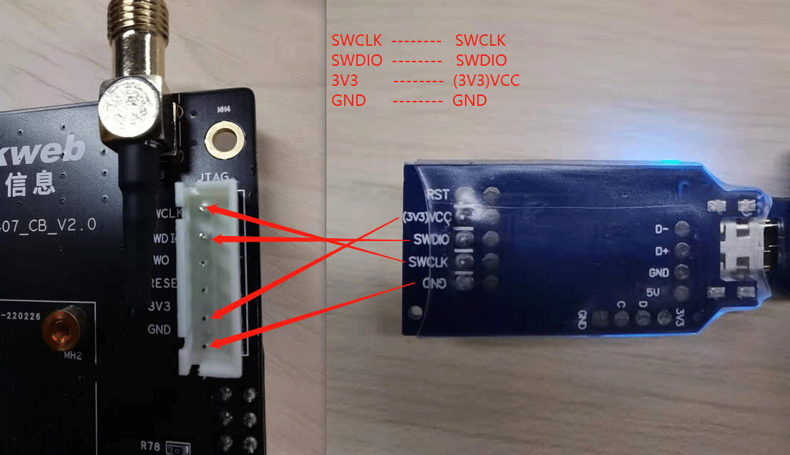

# 固件烧录

- 下载J-Flash烧录软件
    [https://www.segger.com/downloads/jlink/](https://www.segger.com/downloads/jlink/)

    

- 打开J-Flash软件，选择Create new project -> Start J-Flash创建新工程

    

- 点击...按钮选择烧录目标设备

    

- 在device栏输入STM32F407,选择STM32F407IG，点击OK

    

- 将编译后生成的\\out\niobe407\niobe407\OHOS_Image_AllInOne.bin文件拖拽至J-Flash右侧空白区域，烧录起始地址使用默认的8000000，点击OK即可

    

- 连接J-LINK-OB与开发板，接线如下图所示：

    

- 通过USB连接电脑与J-LINK-OB烧录器，并打开设备管理器，确认J-LINK设备连接成功

    

- 点击菜单栏Target->Production Programming（或者直接按F7）开始固件烧录

    

- 烧录成功会弹出如下提示框：

    

- 关闭J-FLASH软件，复位设备。[```注意使用J-LINK-OB烧录时，必须关闭烧录软件后再复位，程序才能正常运行```]。

# U盘升级
- 准备一个FAT32格式U盘。
- 将编译后生成的`\\out\niobe407\niobe407\OHOS_OTA.bin`文件拷贝至U盘根目录。
- 将U盘插入到开发板USB口中，按下复位按键，等待升级即可。
- 在调试信息中看到如下打印，并结合app启动LOG中的版本信息，即可确定是否升级成功。

    
