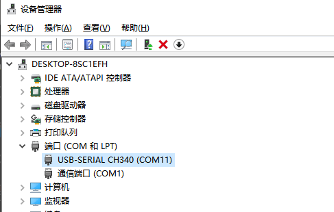
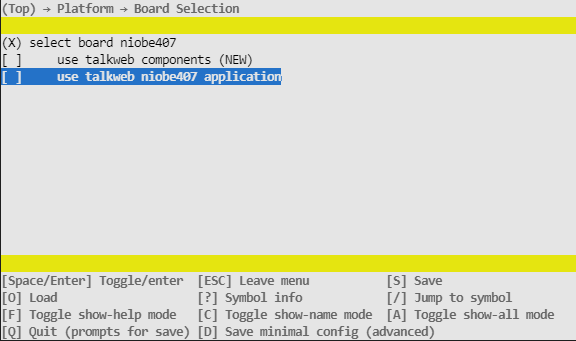

# 快速开发指南

## 1.调试打印
- 如下图所示，通过typeC接口的usb线连接开发板与电脑:

    

- 在设备管理器中查看正确的COM号：

    

- 打开串口终端(此处使用的xshell，也可用其它终端代替), 将波特率设置为`115200`：

    

    

    

- 复位设备，即可在终端看到如下系统运行的打印（`配置开启的功能不同，打印信息也可能不同`）:

    

## 2.运行示例程序
- 我们在//device/board/talkweb/niobe407/applications目录下提供了多个示例程序供大家参考，并且可以通过menuconfig配置快速选择运行对应的示例程序。使用步骤如下:

    1.进入//kernel/liteos_m目录
    ```shell
    cd kernel/liteos_m
    ```
    2.执行make menuconfig
    ```shell
    make menuconfig
    ```
    3.通过方向键和回车选择并进入Platform->Board Selection选项

    

    4.通过方向键移动至use talkweb niobe407 application选项，通过回车选择使用示例程序

    

    5.进入niobe407 application choose选项，选择要运行的示例程序：

    

    具体示例功能请参考：
    
    | 示例名称| 示例说明 |
    | :---- | :---- |
    | 调试打印示例 | [001_system_helloworld](../../applications/001_system_helloworld/README_zh.md) |
    | 线程使用示例 | [002_system_thread](../../applications/002_system_thread/README_zh.md) |
    | 定时器使用示例 | [003_system_timer](../../applications/003_system_timer/README_zh.md) |
    | 事件使用示例 | [004_system_event](../../applications/004_system_event/README_zh.md) |
    | 互斥锁使用示例 | [005_system_mutex](../../applications/005_system_mutex/README_zh.md) |
    | 信号量使用示例 | [006_system_semp](../../applications/006_system_semp/README_zh.md) |
    | 消息队列使用示例 | [007_system_message](../../applications/007_system_message/README_zh.md) |
    | ADC温度采集示例 | [101_peripheral_adc_temperature](../../applications/101_peripheral_adc_temperature/README_zh.md) |
    | 硬件随机数生成示例 | [102_peripheral_rng_number](../../applications/102_peripheral_rng_number/README_zh.md) |
    | CAN数据收发示例 | [103_peripheral_can_example](../../applications/103_peripheral_can_example/README_zh.md) |
    | HDF gpio按键示例 | [201_hdf_gpio_key](../../applications/201_hdf_gpio_key/README_zh.md) |
    | HDF SPIFlash读写示例 | [202_hdf_spi_flash](../../applications/202_hdf_spi_flash/README_zh.md) |
    | HDF 串口示例 | [203_hdf_usart](../../applications/203_hdf_usart/README_zh.md) |
    | HDF I2C读写示例 | [204_hdf_i2c](../../applications/204_hdf_i2c/README_zh.md) |
    | HDF 看门狗示例 | [205_hdf_watchdog](../../applications/205_hdf_watchdog/README_zh.md) |
    | TCP客户端示例 | [301_network_tcpclient](../../applications/301_network_tcpclient/README_zh.md) |
    | TCP服务端示例 | [302_network_tcpserver](../../applications/302_network_tcpserver/README_zh.md) |
    | UDP测试示例 | [303_network_udptest](../../applications/303_network_udptest/README_zh.md) |
    | iperf带宽测试示例 | [308_network_iperf_server](../../applications/308_network_iperf_server/README_zh.md) |
    | Key-Value存储示例 | [401_file_kv_store](../../applications/401_file_kv_store/README_zh.md) |
    | 文件读写示例 | [402_file_fs_store](../../applications/402_file_fs_store/README_zh.md) |
    | CCRAM内存使用示例 | [501_optimization_ccmram_use](../../applications/501_optimization_ccmram_use/README_zh.md) |


    6.保存配置并退出menuconfig(按下`"s"`键保存配置,然后回车两次确定，再按下`"q"`键退出配置)

    

    7.回到根目录编译代码
    ```shell
    cd ../../
    ```
## 3.编写自己的应用程序
- 如果需要开发自己的应用程序，参考步骤如下:
    - 在menuconfig配置中关闭use talkweb niobe407 application选项,并保存配置。

        

    - 在`//device/board/talkweb/niobe407/applications`目录下，复制与您应用功能开发最相近的application示例程序，并修改文件夹名称(此处以修改为`test`为例)

        

    - 修改`//device/board/talkweb/niobe407/applications/BUILD.gn`,在末尾位置将自己写的应用目录名称添加至编译脚本[ ]中。

        

    - 参考`//device/board/talkweb/niobe407/applications`下示例代码，根据实际情况修改`//device/board/talkweb/niobe407/applications/test/BUILD.gn`编译脚本及目录下的源码文件。

    - 以如下编译脚本为例:

        
        
        `sources` : 指定参与编译的源文件。

        `include_dirs` : 指定编译搜索头文件路径。

        此外还可以通过如下关键字指定编译相关选项:

        `cflags`: 编译阶段指定的参数

        `ldflags`: 链接阶段指定的参数

        Tips:构建系统默认会搜索`"."`和`"./include"`目录下的头文件，无需重复指定。
    
    - 添加头文件`#include "ohos_run.h"`

    - 通过`OHOS_APP_RUN`宏指定应用程序函数入口。(`注意该入口函数的返回值和一个形参必须为void，并且应用程序函数入口只能指定一个`)

    - 回到sdk代码根目录，编译代码即可。
## 4.内核扩展功能的使用
除了例程外，一些内核扩展功能也能在menuconfig中选择是否开启:
- shell命令行支持:

    
    
    Tips: 开启后可以通过命令行执行一些基础功能，支持的命令可通过help查看。
    
    

- littlefs文件系统支持:

    

    Tips: 开启后可以在打印信息中看到文件系统挂载成功的提示，如果有文件操作需求则需要打开该选项。

    

- lwip支持:

    

    Tips: 当需要使用到有线网络时，需要开启该选项。

- HDF驱动框架支持:

    

    Tips: 当需要使用到HDF驱动框架时，需要开启该选项。

